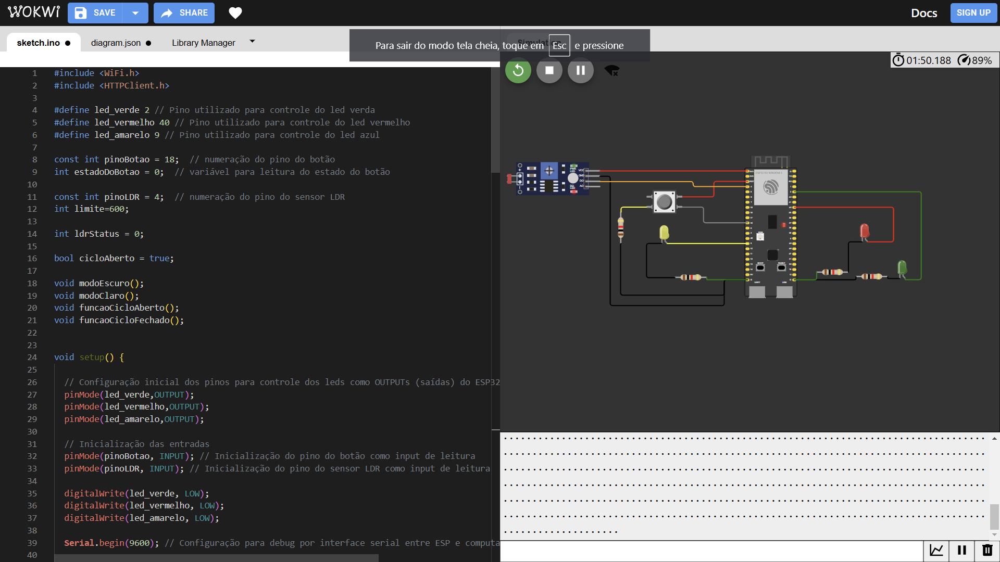

# Estados:
- Minha implementação para a código do Semáforo se ateve a três variáveis para representação de estado: ```int estadoDoBotao```, ```bool cicloAberto``` e ```ldrStatus```. O estado do botão é representado por um inteiro que pode assumir os valores 0 e 1, onde 0 representa o botão sem estar pressionado, e 1 representa o botão pressionado. O estado do ciclo é representado por um booleano que pode assumir os valores true e false, tais que `true` representa o ciclo aberto (Semáforo mantém o LED Verde aceso e os demais desligados) e false representa o ciclo fechado (Semáforo mantém o LED Vermelho aceso e os demais desligados). Já o `ldrStatus` é um inteiro que representa o estado do LDR, podendo assumir os valores analógicos medidos pelo pino analógico conectado ao LDR.
- A claridade do ambiente é aferida a cada loop e o valor é armazenado na variável `ldrStatus`. Caso o valor seja inferior ao `limite`, definido acima o setup do código, o semáforo entra no modo escuro (aciona um função que pisca o LED amarelo) e caso contrário, o semáforo entra no modo claro (aciona um função que roda um ciclo de verde, amarelo e vermelho conforme especificado no GoogleForms).

# Print do Código em Funcionamento:


- Acima está um print mostrando o código em funcionamento no WOKWI. É possível observar que o monitor Serial está repleto de pontos `.`, que estam printados pois o ESP32 está parado no seguinte `while`, que verifica se a conexão com a rede WiFi foi bem sucedida:
```c++
  while (WiFi.status() != WL_CONNECT_FAILED) {
    delay(100);
    Serial.print(".");
  }
```
- Não foi possível realizar uma conexão bem sucedida com o Wi-Fi do Inteli, nem um Hotspot do celular, porém o código está funcionando corretamente, com o semáforo tendo os ciclos executados e a cada ciclo, o LDR sendo aferido e o semáforo entrando no modo claro ou escuro conforme a claridade do ambiente.